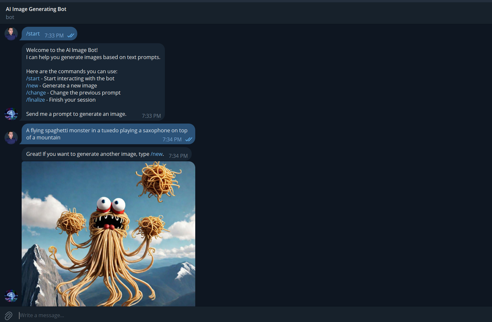
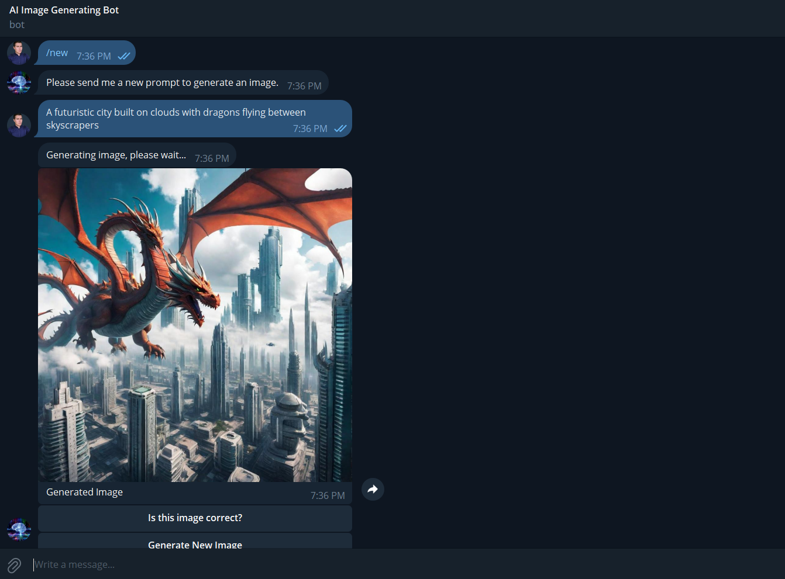
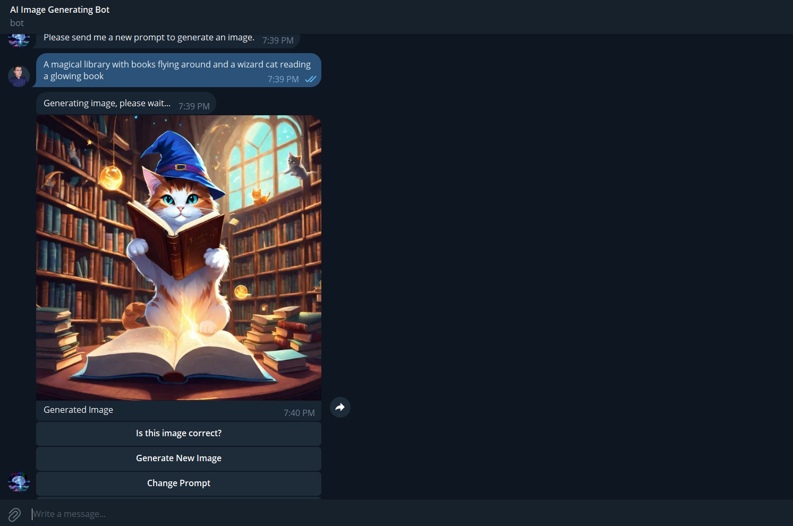
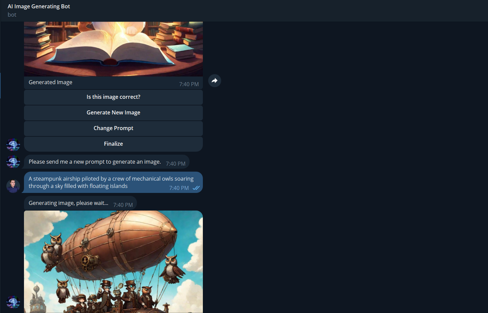
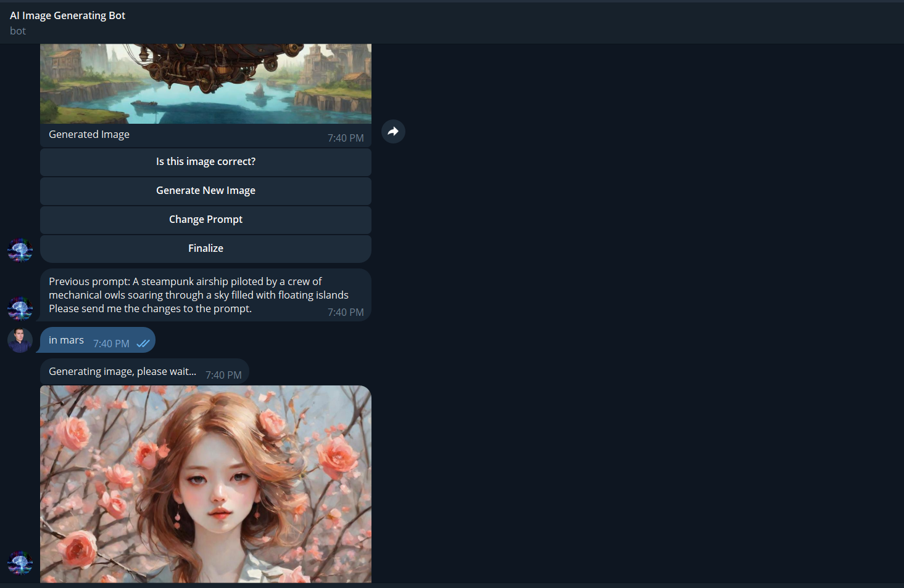
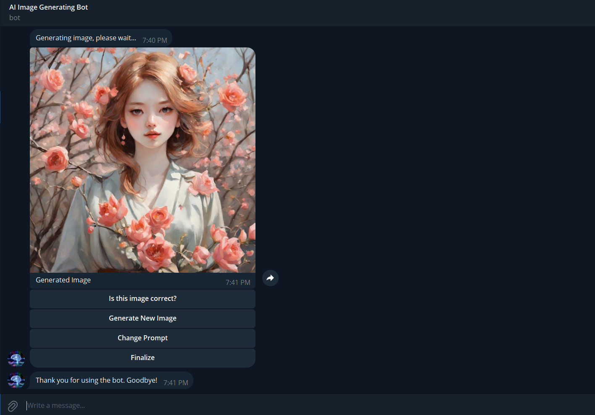

# AI Telegram Image Bot
The AI_Telegram_ImageBot project is an image-generating bot developed using the Python programming language and the Telegram API. The bot generates images based on user-provided prompts using the LimeWire API.*.

## Features

#### 1. Bot Operation
- Initialization and Setup
- Interacting with the Bot
- Example of Functions
#### 2. Setup
- Clone the Repository
- Create .env File
- Install Dependencies
- Activate Virtual Environment
- Running the Bot
#### 3. Example Usage
#### 4. More Information
#### 5. Screenshots

## 1. Bot Operation:
### Initialization and Setup
- The bot is initialized by sending the /start command in Telegram.
- The Telegram API token and LimeWire API key must be configured in a .env file.

### Interacting with the Bot
- Users can send prompts to the bot to generate images.
- The bot provides options to accept the image, generate a new one, change the prompt, or finalize the session.

### Example of Functions
- The user starts the bot with /start.
- The user sends a prompt, for example, "A beautiful sunset over the mountains".
- The bot generates an image and provides options for the user to interact.

## 2. Setup
### Clone the Repository:
        git clone https://github.com/netto14cr/AI_Telegram_ImageBot.git

### Create .env File
- Create a .env file in the project root directory.
- Add your Telegram API token and LimeWire API key to the .env file.

#### *.env*
        TELEGRAM_TOKEN=your_telegram_token_here
        LIMEWIRE_API_KEY=your_limewire_api_key_here

### Install Dependencies
#### *sh*
        python -m venv env
        source env/bin/activate  # For Linux/Mac
        .\env\Scripts\activate  # For Windows
        pip install -r requirements.txt

### Activate Virtual Environment
- For Linux/Mac:
        source env/bin/activate

- For Windows:
        .\env\Scripts\activate

### Running the Bot
        python ai_telegram_imagebot.py

## 3. Example Usage:
- User: /start
        
        Bot: "Welcome to the Image Bot!
        You can use the following commands:
        /new - Generate a new image
        /change - Change the previous prompt
        /finalize - Finish your session
        Please send me a prompt to generate an image."

- User: *"A beautiful sunset over the mountains"*

        Bot: "Generating image, please wait..."
        Bot: [Image of sunset over mountains]
        Bot: "Is this image correct?" 
        [Options: 
                Correct, 
                Generate New Image, 
                Change Prompt, 
                Finalize
        ]

- User: Selects *"Generate New Image"*

        Bot: "Please send me a new prompt to generate an image."

- User: *"A serene beach with palm trees"*

        Bot: "Generating image, please wait..."
        Bot: [Image of serene beach with palm trees]
        Bot: "Is this image correct?" [Options: Correct, Generate New Image, Change Prompt, Finalize]

- User: Selects "Finalize"
        Bot: "Thank you for using the Image Bot. Goodbye!"

## 4. More Information

Visit the LimeWire API key settings page for more information: LimeWire API Key

## Screenshots

###  License
***Note: This bot is for educational purposes and may not generate accurate images for all prompts.*
